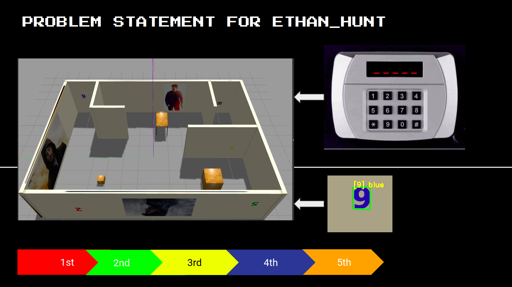
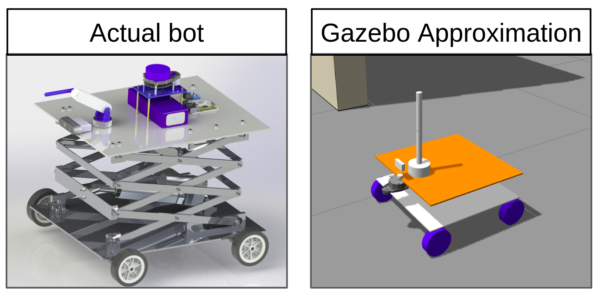
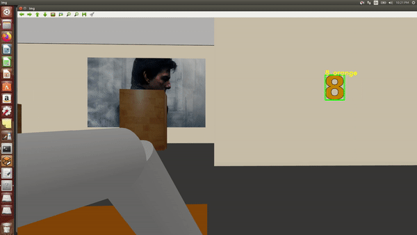
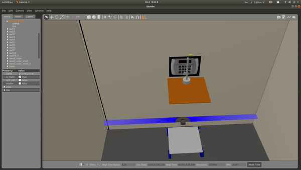
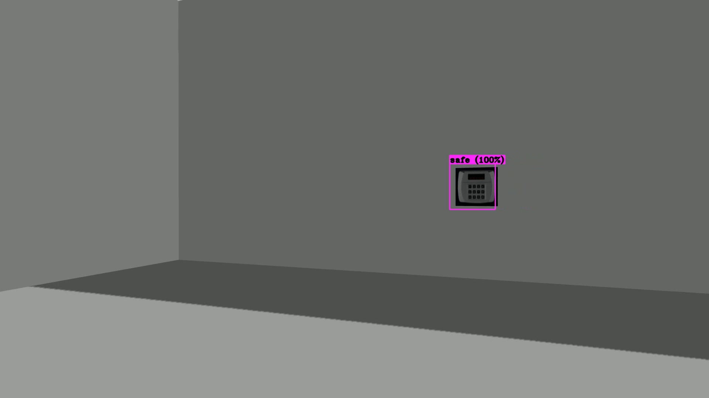
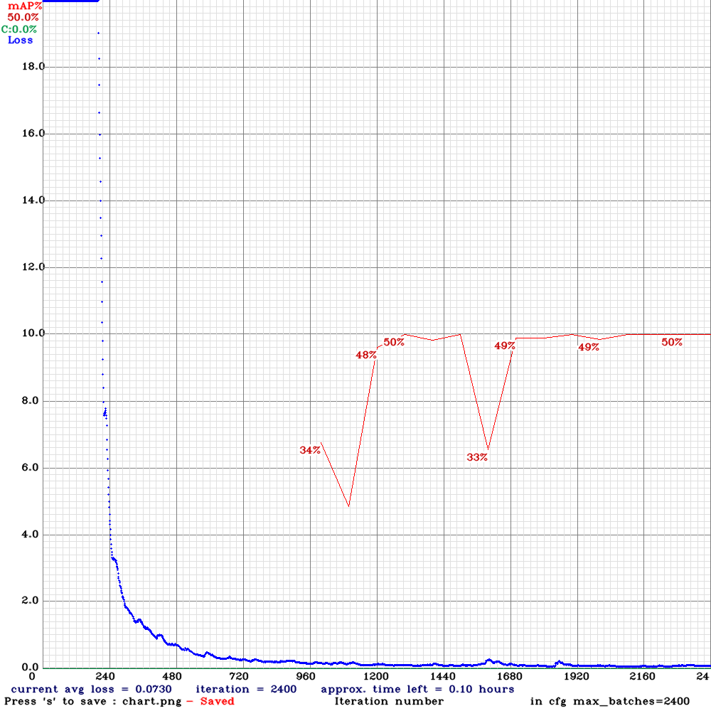
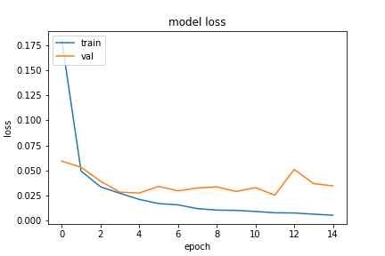
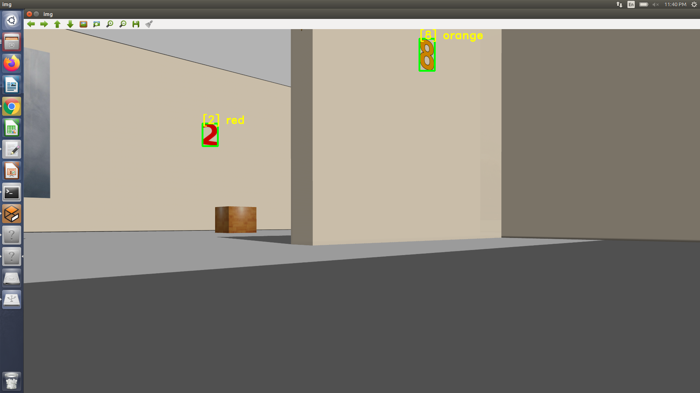

#  Problem Statement

The Robot is launched in an unknown apartment, it has to find the passcode of safe which is located in the same apartment. The digits of passcode are written on walls at different locations robot has to recognize this digits and decode the passcode, the hint for passcode sequence is 1st digit is red, 2nd is green, 3rd is yellow, 4th is blue and 5th is orange. Once bot decodes the passcode and saves, it has to search for safe and press the keys for unlocking the safe!

**But, here is the catch !** :  Safe is at 100cm and appartment is armed with lasers which will detect any thing above 50cm. So, our bot design should be in a such way that it will have height less than 50cms and will be able to extend itself upto 100cms !

#  Here is how our bot looks !

#  Final Results

<!-- # ML
1.Yolo model folder contatins the files of the yolo v3 tiny model trained on custom dataset
\
2. process involved for making custom dataset mentioned in yolo mark folder

3.model's loss graph metrics trained on colab:

4.colab notebook: code for training a keras model with mnist dataset:
\

5.Code implementation in file digit_reco_keras.py:

\
Lane's apartment: model of the final world
\
data: files used for testing ml models
\
temp: files shared b/w team members (not necessarily part of final project) -->
